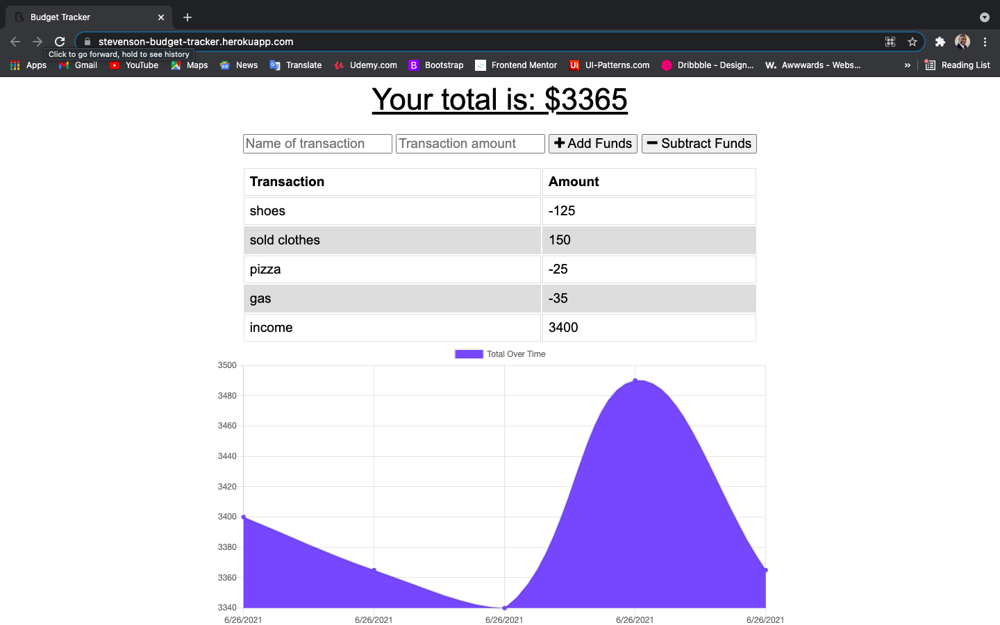

# Budget-Tracker

In this Budget-Tracker, I added some functionality to allow a user to enter in expenses and income while being offline, and when online is available, the database will populate and update on the browser. This is an easy and quick way to track your daily spending, while also allowing offline functionality.

## User Story
AS AN avid traveller
I WANT to be able to track my withdrawals and deposits with or without a data/internet connection
SO THAT my account balance is accurate when I am traveling

## Operation

* On the first screen you will can see the information avaible to enten in and track your expenses. click the login button, located at the top of the home page.

* Under the login button, you will see a link to sign up. Click this link if this is the first time you will be adding content onto the page. Otherwise, enter in your username and password.

