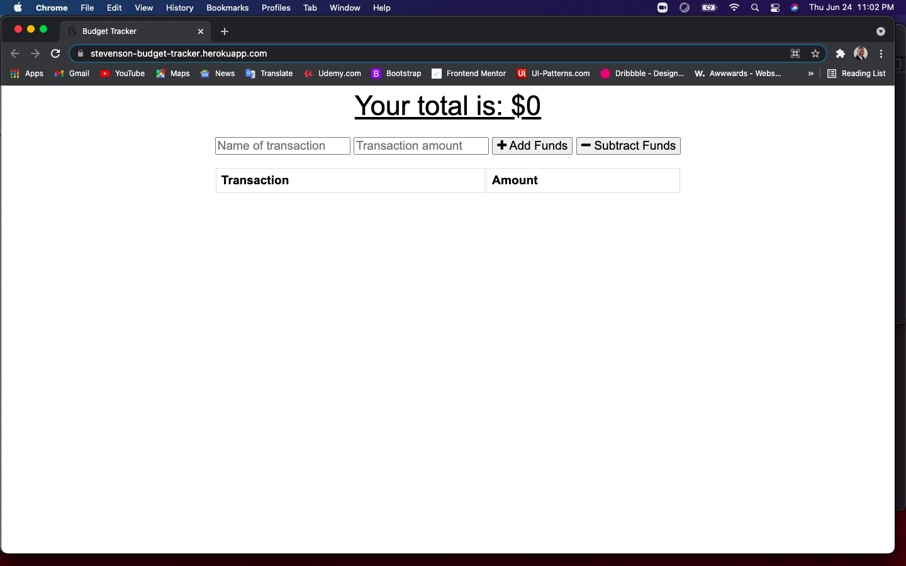

# Budget-Tracker

In this Budget-Tracker, I added some functionality to allow a user to enter in expenses and income while being offline, and when online is available, the database will populate and update on the browser. This is an easy and quick way to track your daily spending, while also allowing offline functionality.

## User Story
AS AN avid traveller.
I WANT to be able to track my withdrawals and deposits with or without a data/internet connection.
SO THAT my account balance is accurate when I am traveling.

## Operation

* On the first screen you will can see the information avaible to enter in and track your expenses. Fill in the name of your expense or income and click the corrosponding transaction button.

* On the next screen you will see the transactions that you have entered. If you don't have internet access, you will still be able to enter in your transactions, and it will populate in the app and datbase, when the internet connection is restored.

* Here you see how the MongoDb Atlas database is saving in the transaction information for income. 

* This screen shows the saved expenses and a small income from the sale of clothes, in MongoDB Atlas.

## App Information & Link

* This app uses HTML, CSS, JavaScript, Express.js, Mongoose, & MongoDB to give you a great user experience while you keep track of your everyday expenses. This web application is deployed on the Heroku platform and stored on the Github.com platform.

* You can also reach the app using this link to Heroku: [Budget Tracker](https://stevenson-budget-tracker.herokuapp.com/)

* The code for this app can be found on the following link on GitHub: [Online-Offline-Budget-Tracker](https://github.com/sawhite110/Online-Offline-Budget-Tracker.git)